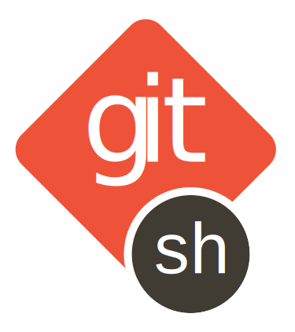

# 

The `gitsh` program is an interactive shell for git. From within `gitsh` you can
issue any git command, even using your local aliases and configuration.

For a quick introduction to `gitsh`, watch [our video on Upcase][]. For further
documentation, you can view the man page by running `man gitsh` in your
terminal.

[our video on Upcase]: https://upcase.com/videos/gitsh?utm_source=github&utm_medium=open-source&utm_campaign=gitsh

## Why should you use gitsh?

* Git commands tend to come in groups. Avoid typing `git` over and over and over
  by running them in a dedicated git shell:

  <pre><code>sh$ gitsh
  gitsh% status
  gitsh% add .
  gitsh% commit -m "Ship it!"
  gitsh% push
  gitsh% <kbd>ctrl</kbd>-<kbd>d</kbd>
  sh$
  </code></pre>

* Hit <kbd>return</kbd> with no command to run `git status` (change this
  command by setting `gitsh.defaultCommand` via `git config`; remember it will
  be prefixed with `git `), saving even more typing:

      gitsh% ⏎
      # On branch master
      nothing to commit, working directory clean
      gitsh%

* Easily execute shell commands:

      gitsh% !echo Hello world
      Hello world
      gitsh%

* Combine commands with `&&`, `||`, and `;`:

      gitsh% commit && push

* Make temporary modifications to your git configuration with gitsh config
  variables. These changes only affect git commands issued in this gitsh
  session and are forgotten when you exit, just like shell environment
  variables.

      gitsh% :set user.name 'George Brocklehurst and Mike Burns'
      gitsh% :set user.email support+george+mike@thoughtbot.com
      gitsh% commit -m 'We are pair programming'

* Access information about your repository with magic variables like
  `$_rebase_base`, `$_merge_base` and `$_prior`.

      gitsh% rebase master
      CONFLICT (content): Merge conflict in db/schema.rb
      gitsh% checkout $_rebase_base -- db/schema
      gitsh% !rake db:schema:load db:migrate

* Tab completion for git commands, aliases, and branches without modifying your
  shell settings, and without any extra setup for aliases and third party
  git commands.

* Information about the state of your git repository in the prompt, without
  modifying your shell settings. This includes the name of the current HEAD, and
  a colour and sigil to indicate the status.

* It works with [`hub`][hub] and [`gh`][gh]:

      sh$ gitsh --git $(which gh)
      gitsh% pull-request

## Installing gitsh

* macOS, via Homebrew:

      brew tap thoughtbot/formulae
      brew install gitsh

* Arch Linux: https://github.com/thoughtbot/gitsh/blob/master/arch/PKGBUILD

* OpenBSD -current:

      sudo pkg_add gitsh

See the [installation guide][INSTALL] for install instructions for other
operating systems.

## Contributing to gitsh

Pull requests are very welcome. See the [contributing guide][CONTRIBUTING] for
more details.

## Similar projects

* [git-sh][] - A customised bash shell with a Git prompt, aliases, and
  completion.
* [gitsh][] - A simple Git shell written in Perl.
* [repl][] - Wraps any program with subcommands in a REPL.

[hub]: http://hub.github.com/
[gh]: https://github.com/jingweno/gh
[INSTALL]: https://github.com/thoughtbot/gitsh/blob/master/INSTALL
[CONTRIBUTING]: https://github.com/thoughtbot/gitsh/blob/master/CONTRIBUTING.md
[LICENSE]: https://github.com/thoughtbot/gitsh/blob/master/LICENSE
[git-sh]: https://github.com/rtomayko/git-sh
[gitsh]: https://github.com/caglar/gitsh
[repl]: https://github.com/defunkt/repl

## License

gitsh is Copyright © 2016 Mike Burns, George Brocklehurst, and thoughtbot. It is
free software, and may be redistributed under the terms specified in the
[LICENSE][LICENSE] file.

## About thoughtbot

Created, maintained and funded by [thoughtbot][team].
The names and logos for thoughtbot are trademarks of thoughtbot, inc.

[team]: https://thoughtbot.com?utm_source=github

We love open source software!
See [our other projects][community].
We are [available for hire][hire].

[community]: https://thoughtbot.com/tools?utm_source=github
[hire]: https://thoughtbot.com/hire-us?utm_source=github
